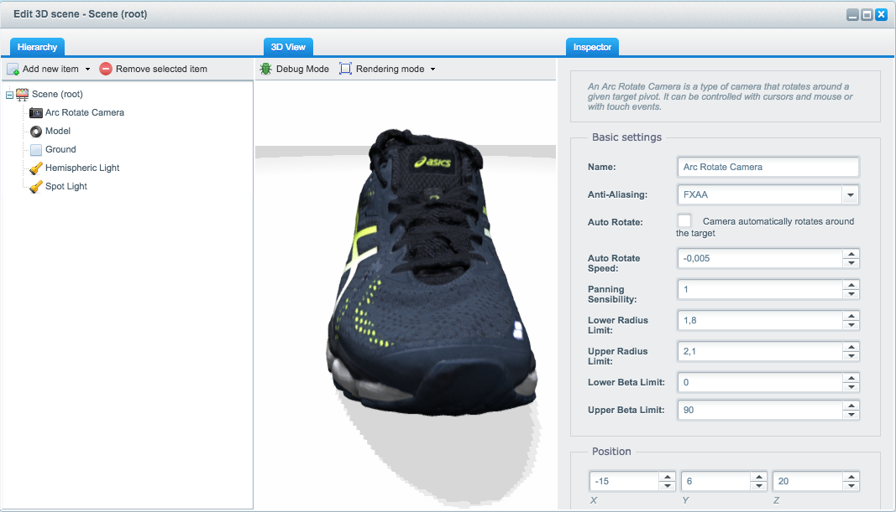

# Shopware 3D Product Viewer Beta
* **Github Repository**: https://github.com/shopwareLabs/SwagThreeSixtyViewer
* **Minimum Shopware version**: [Shopware 5.2.21](http://community.shopware.com/Downloads_cat_448.html#5.2.21)

## Overview
The Shopware 3D Product Viewer provides you with the ability to create your very own 3D scenes including your custom 3D models right inside your Shopware administration. The plugin is based on the 3D framework [Babylon.js](https://github.com/BabylonJS/Babylon.js) and provides an easy-to-use way to get 3D content in your Shopware shop. The following features are available to you:

- Import from your own models (`*.obj`, `*.dae` & `*.babylon` are supported)
	- Export from [Unity](https://github.com/BabylonJS/Babylon.js/tree/master/Exporters/Unity%205), [Blender](https://github.com/BabylonJS/Babylon.js/tree/master/Exporters/Blender), [Maya](https://github.com/BabylonJS/Babylon.js/tree/master/Exporters/Maya/Tools), [3ds Max](https://github.com/BabylonJS/Babylon.js/tree/master/Exporters/3ds%20Max) are available
	- A [command line tool](https://github.com/BabylonJS/Babylon.js/tree/master/Exporters/FBX) for converting `*.fbx` to `*.babylon` is also available
- Dynamic shadows generator
- Supports different types of lights
	- Point light, Spot light & Hemisperic light
- Supports basic shapes
	- Cyclinder, Box & Ground Plane
- Supports different materials for basic shapes
	- Diffuse, Specular & Ambient color / texture
	- Bump map support
- Positioning, Scaling & Rotation of objects
- Scene Fog with different modes
- Highlight model on selection
- Debug mode for easier scene creation
- Two different anti-aliasing modes for your scene
- Different rendering modes - Wireframe, Point, Solid

## Beta & support notice 
This is beta software and may have serious bugs which may
cause damage to your Shopware installation. It is intended for beta testers only and must not be used in production systems.

**Use at your own risk, there is no support for this plugin.**

## Installation
The plugin isn't available on the [Shopware Community Store](https://store.shopware.com/) yet. You have to download the plugin on your own and upload it using FTP / FTPS / SSH to your server.

Next head to your Shopware administration, go to "Settings" -> "Plugin-Manager" and install the "3D Product Viewer".

## Known issues
- Translations & ACL rules are missing
- Resizing the ground plane or cylinder isn't working when the model is already rendered.
- Changing the path of a model after it's been rendered isn't working. You have to delete the model and add it again at the moment.

## How to use / Tips & Tricks
- First create a new scene
- Next add a camera and change the position of the camera to `0, 0, 10` for example
	- The camera determines the view of the scene you're creating
- Now add a hemispheric light to get a basic lighning in your scene. Keep in mind that this type of light doesn't supports dynamic shadows.
- If you're working with spot lights, please set the Y-direction to `-1` to let the light shine down on your object.  

## License
The MIT License (MIT). Please see [License File](https://github.com/shopwareLabs/SwagThreeSixtyViewer/blob/master/LICENSE "License File") for more information.